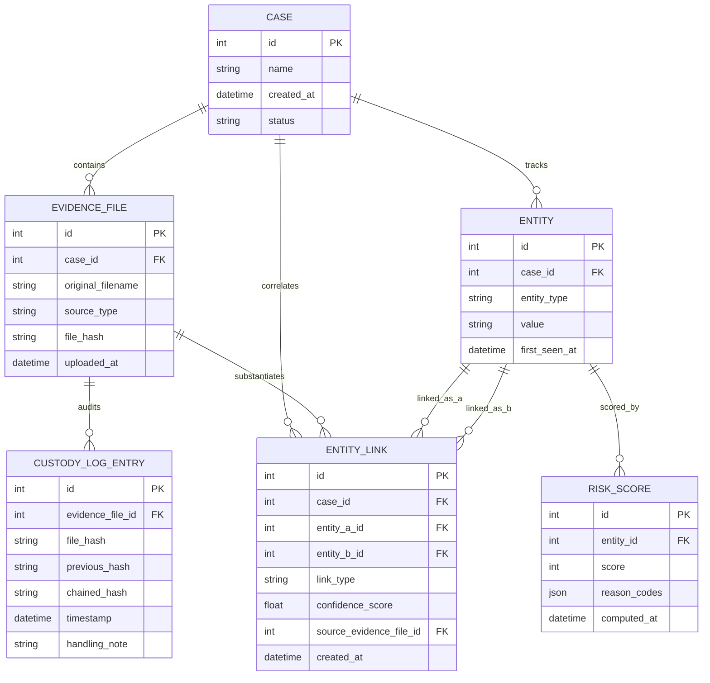

# Architecture & System Design

## System Overview
The Cyber Fraud Correlator is a dual-tier analytical system designed to ingest, normalize, and cross-correlate disparate evidentiary data sources—including telecom call detail records (CDR) and IP detail records (IPDR), bank and Unified Payments Interface (UPI) transaction ledgers, email communication headers, and Android forensic extraction dumps. Operating via an asynchronous FastAPI backend and a high-density React/TypeScript investigative console, the platform constructs an in-memory multidimensional entity graph to reveal hidden identifier overlaps (e.g., shared IMEI/IMSI pairs, mule account routes, common IP addresses, and communication clusters), computes deterministic risk scoring models, and compiles an automated, court-admissible one-page investigative summary brief.

## Data Flow

1. **Ingestion & Normalization**: Multi-source file intake, defensive parsing, case-scoped entity deduplication, and relational persistence.
2. **Entity Resolution & Linkage** *(Planned)*: Ingestion into NetworkX graph model with identity resolution across disparate records.
3. **Risk Scoring Engine** *(Planned)*: Graph centrality, velocity analysis, and behavioral fraud scoring heuristics.
4. **Investigative Brief Generation** *(Planned)*: Dynamic PDF synthesis via ReportLab for field and court distribution.

## Ingestion Pipeline

The ingestion pipeline converts heterogeneous, raw forensic artifacts into a clean, normalized relational graph of `Entity` and `EntityLink` records. It operates defensively: malformed or corrupted rows degrade gracefully with structured warnings and row counters rather than failing the pipeline, while unparseable or severely corrupt files raise a descriptive `IngestionError`.

### Pipeline Data-Flow

```
Raw File / Stream (.csv, .xlsx, .eml, .json, .txt)
                    │
                    ▼
           [ normalizer.py ]  (Shared Entry Point)
                    │
                    │ 1. Dispatch by SourceType
                    ▼
  ┌────────────────────────────────────────────────────────┐
  │  Specialized Parsers (app/services/ingestion/parsers/) │
  ├────────────────────────────────────────────────────────┤
  │  • CDRParser        (telecom CDR/IPDR CSV/Excel)       │
  │  • BankParser       (bank & UPI transaction sheets)    │
  │  • EmailParser      (.eml MIME headers & IP hop chain) │
  │  • AndroidLogParser (JSON & text extraction dumps)     │
  └────────────────────────────────────────────────────────┘
                    │
                    │ 2. Intermediate Uniform Shape
                    ▼
         list[ParsedRecord]
         {
           entity_type: EntityType,
           value: normalized_str,
           linked_entities: list[LinkedEntityRef],
           source_row_ref: str
         }
                    │
                    │ 3. Case-Scoped Deduplication & Linkage
                    ▼
           [ normalizer.py ]
                    ├── Check DB entity cache for (case_id, entity_type, value)
                    │     └── If existing: reuse Entity.id
                    │     └── If new: persist new Entity row, track entities_created
                    ├── Canonicalize link pairs (entity_a_id < entity_b_id)
                    ├── Avoid link duplicates within case (case_id, entity_a_id, entity_b_id, link_type)
                    │     └── Persist new EntityLink row (with confidence_score)
                    └── Commit session
                    │
                    ▼
             IngestionResult
             {
               summary: IngestionSummary(rows_processed, rows_skipped, entities_created, entity_links_created),
               entities: list[Entity],
               entity_links: list[EntityLink]
             }
```

### Key Components

1. **Defensive Normalization (`base.py`)**: Sanitizes and normalizes phone numbers (E.164-compliant formatting), emails (lowercase, clean display names), device IMEIs (14-16 digit validation), MAC addresses (colon-separated uppercase `XX:XX:XX:XX:XX:XX`), IP addresses (IPv4/IPv6 validation and loopback filtering), and accounts/UPI handles. Flexible timestamp parser handles ISO 8601, slash/dash formats, and epoch milliseconds.
2. **Intermediate Representation (`models.py`)**: All parsers return `ParserResult` composed of `ParsedRecord` items containing `LinkedEntityRef` objects. This decouples parsing from persistence and removes per-parser special-casing in the normalizer.
3. **Case-Scoped Entity Deduplication (`normalizer.py`)**: Guarantees that within an investigation case, unique identifiers (e.g., a phone number or IMEI appearing across both a CDR dump, a bank statement, and an Android log) resolve to a single `Entity` record.
4. **Co-Occurrence Entity Linkage**: Intra-record co-occurrences automatically generate `EntityLink` records with typed relationships (`SHARED_IMEI`, `SHARED_UPI_HANDLE`, `SHARED_MAC`, `SHARED_IP_SUBNET`, `DIRECT_COMMUNICATION`, `TRANSACTION`) and deterministic confidence scores.

## Evidentiary Integrity

The platform enforces cryptographic provenance through an append-only custody hash chain built on chunked streaming SHA-256 digests. Each ingested evidence file is hashed at intake, and its corresponding `CustodyLogEntry` calculates a chained hash that incorporates the preceding entry's hash (`sha256(file_hash + ":" + previous_chained_hash)`), creating a tamper-evident audit ledger across all investigative artifacts. The `CustodyChainService` systematically verifies this chain from genesis to head, detecting unauthorized file modifications, missing log records, or altered entries to guarantee strict compliance with Section 65B of the Indian Evidence Act (and Section 63 of Bharatiya Sakshya Adhiniyam, 2023) certificates of authenticity.

## Data Model
The normalized schema collapses multi-source evidentiary artifacts into a structured relational representation using SQLModel (SQLAlchemy + Pydantic) on SQLite.



### Table Definitions & Roles
1. **`Case` (`case`)**: Top-level investigative envelope organizing evidence, normalized entities, and correlated linkages.
2. **`EvidenceFile` (`evidence_file`)**: Uploaded forensic artifacts (CDR, IPDR, Bank/UPI, Email headers, Android logs) with SHA-256 integrity verification.
3. **`CustodyLogEntry` (`custody_log_entry`)**: Immutable audit trail entries forming a hash-linked chain of custody for court admissibility.
4. **`Entity` (`entity`)**: Extracted identifiers (phone numbers, bank accounts, device IMEIs, IP addresses, MACs, emails) normalized across evidence files.
5. **`EntityLink` (`entity_link`)**: Cross-entity relationships discovered across artifacts with deterministic signal types and confidence scores ($0.0 - 1.0$).
6. **`RiskScore` (`risk_score`)**: Entity risk evaluation ($0 - 100$) annotated with investigative reason codes for prioritisation.


## Entity Correlation

The correlation engine converts the flat `Entity` + `EntityLink` relational tables into a confidence-weighted `networkx.Graph` and exposes it in clean JSON to the investigative frontend.

### Why Confidence Weights Matter More Than Binary Linking

Binary graph connectivity (connected = guilty, disconnected = innocent) is demonstrably inappropriate for cyber fraud investigations. In India, **Carrier-Grade NAT (CGNAT)** means thousands of prepaid mobile subscribers can share a single public IPv4 address. A purely topological approach—treating every IP co-occurrence as a definitive link—would wrongly implicate innocent bystanders. Courts examining Section 65B evidentiary certificates are sensitive to this: the weighting of each link type must be **transparent, documented, and calibrated to the underlying forensic mechanism**.

### Confidence Weight Table

All weights are **named constants** in `confidence_rules.py`, documented with judicial-quality rationale:

| Link Type | Confidence | Label | Rationale |
|---|---|---|---|
| `shared_imei` | **0.85** | Strong | Immutable hardware IMEI burned into baseband; near-conclusive physical device possession. |
| `shared_upi_handle` | **0.80** | Strong | KYC-verified VPA tied directly to an identified bank account; recurring beneficiary route = economic collusion. |
| `transaction` | **0.75** | Strong | Verified bank ledger transfer establishes direct money-flow causality. |
| `direct_communication` | **0.70** | Strong | Bilateral CDR call/SMS demonstrates active operational coordination. |
| `shared_mac` | **0.60** | Medium | Network interface identifier; genuine but moderated by iOS 14+/Android 10+ randomized MAC privacy. |
| `co_occurrence` | **0.40** | Weak | Circumstantial cell-tower/temporal overlap with no direct communication or hardware link. |
| `shared_ip_subnet` | **0.30** | Weak | CGNAT subnets are shared by thousands; alone this is never sufficient for attribution. |

### Weak-Signal Compounding Formula

When **multiple independent weak signals** (each `< 0.50`) connect the same two entities, the system escalates the combined confidence using a **probabilistic independence model** rather than simply taking the max:

```
C_combined = 1 - prod_i (1 - w_i)
```

**Rationale:** If each weak signal `w_i` independently indicates a genuine link with probability `w_i`, then the probability that *all* signals are simultaneously false coincidences is `prod(1 - w_i)`. The complement is the probability that *at least one* represents a real evidentiary nexus.

**Concrete examples:**

| Scenario | Calculation | Combined Score | Label |
|---|---|---|---|
| 1x IP subnet (alone) | `0.30` | **0.30** | Weak |
| 2x IP subnet | `1 - 0.70^2` | **0.51** | Medium |
| 3x IP subnet | `1 - 0.70^3` | **0.66** | Medium |
| 5x IP subnet | `1 - 0.70^5` | **0.83** | Strong |
| IP subnet + co-occurrence | `1 - 0.70 x 0.60` | **0.58** | Medium |

This ensures that a suspect accumulating many corroborating weak signals from independent evidence sources is correctly escalated, while a single CGNAT hit remains a non-determinative circumstantial indicator.

### Architecture Components

```
app/services/correlation/
├── confidence_rules.py   — Named constants, weighting table, compounding formula
├── graph_builder.py      — GraphBuilder.build_for_case(case_id) -> networkx.Graph
│                           find_path(graph, a_id, b_id) -> list[int] | None
└── graph_serializer.py   — serialize_graph(graph) -> {nodes, edges} JSON
```

### Graph Structure

- **Nodes** = `Entity` rows (id, entity_type, value, cluster_id)
- **Edges** = consolidated `EntityLink` pairs (confidence, link_type, inverse_confidence)
- **cluster_id** = connected component index (assigned by `networkx.connected_components`)
- **inverse_confidence** = `1 / confidence`, used as edge weight in `networkx.shortest_path` so that high-confidence paths are strictly preferred for the "how are these two connected" feature

### JSON Output Shape (Frontend Contract)

```json
{
  "nodes": [
    {"id": 1, "entity_type": "phone", "value": "+919876543210", "cluster_id": 0}
  ],
  "edges": [
    {"source": 1, "target": 2, "confidence": 0.85, "link_type": "shared_imei", "confidence_label": "Strong"}
  ]
}
```

`confidence_label` is derived by importing `get_confidence_label` from the Phase 1 schema layer (`app/schemas/entity_link.py`) — no threshold duplication across the codebase.

## Risk Scoring

The risk scoring engine computes an operational fraud risk score ($0 - 100$) for extracted entities by evaluating explicit forensic heuristics against the correlation graph. Every score generated by the engine is paired with plain-language, traceable reason codes that explain exactly why an entity was flagged.

### Design Principle: Explainable Rule-Based Heuristics vs. Black-Box ML

A foundational design requirement of this platform is that **no risk score is emitted without an explicit, human-auditable justification**. The scoring engine is deliberately built as an inspectable rule-based system rather than an opaque machine-learning model for the following forensic and legal reasons:

1. **Evidentiary Traceability**: When an investigative dossier is submitted in court or used to obtain search warrants, investigating officers must be able to justify why a specific entity was prioritized. Black-box ML features cannot withstand rigorous judicial cross-examination.
2. **Contestability & Defense Scrutiny**: Under Section 65B of the Indian Evidence Act (and Section 63 of Bharatiya Sakshya Adhiniyam, 2023), automated data analytics must reflect reliable, repeatable processes. Every score is directly traceable to concrete timestamps, transaction counts, and hardware overlaps.
3. **Temporal Stability**: ML models suffer from distributional drift and require periodic retraining that can alter historical scores unpredictably. The deterministic rule-based engine ensures that identical evidentiary artifacts yield identical scores months later during trial.

### Heuristics

The engine evaluates five key operational heuristics:

1. **High-Velocity Multi-Hop Routing (`HIGH_VELOCITY_ROUTING`, weight: 45)**:
   - Detects rapid fund layering where an entity connects to $\ge 3$ distinct neighbor entities within a tight time window (default: 10 minutes) based on normalized `first_seen_at` telemetry.
   - Hallmark of rapid mule layering before bank fraud freezes can occur.

2. **SIM-Switching / Burner Rotation (`SIM_SWITCHING_PATTERN`, weight: 40)**:
   - Detects a single physical handset (`device_imei`) cycling through $\ge 3$ distinct phone numbers within a 24-hour window, or a phone number operating on such a device.
   - Characteristic tactic of call-center fraud operators and cyber syndicates attempting to evade CDR monitoring.

3. **Shared Device with Flagged Peer (`SHARED_DEVICE_FLAGGED_PEER`, weight: 35)**:
   - Flags entities that share physical hardware (`shared_imei` or `shared_mac`) with another entity that has already received a high risk score ($\ge 40$).
   - Inherits suspicion across confederates operating from the same hardware terminal or Wi-Fi tethering setup.

4. **Oversized Syndicate Cluster (`OVERSIZED_CLUSTER`, weight: 20)**:
   - Identifies entities embedded in connected network components whose node count exceeds the case's median cluster size by a factor of $\ge 1.5\times$.
   - Contextual amplifier distinguishing coordinated fraud rings from isolated civilian transactions.

5. **Multi-Account Transaction Hub (`MULTI_ACCOUNT_TRANSACTION_HUB`, weight: 30)**:
   - Identifies accounts converging incoming transaction linkages from $\ge 3$ distinct senders, characteristic of mule aggregation and cash pooling.

### Aggregation & Score Capping

Triggered heuristic weights are combined additively and strictly capped at 100:

$$\text{Risk Score} = \min\left(100, \sum_{r \in \text{Triggered}} \text{weight}(r)\right)$$

The computed score and list of triggered reason codes are persisted into the `RiskScore` relational table for case reporting and audit integrity.

### Human-in-the-Loop Advisory Framing

A strict design constraint governs all system outputs: **the engine advises; it never commands**.

- Output payloads include an advisory `recommendation` field:
  `"Recommended for investigator review — do not act without independent corroboration of the evidence."`
- The entire API surface is devoid of directive or coercive legal commands such as *"arrest"*, *"seize"*, *"detain"*, or *"confiscate"*.
- Investigative decisions remain strictly with authorized law enforcement officers who corroborate graph telemetry with external ground truth.

## Brief Generation

The brief generation subsystem (`app/services/brief/`) assembles all prior pipeline outputs into a distribution-ready investigative package in two formats — structured JSON and a strictly one-page PDF.

### PII Masking (`pii_mask.py`)

Exported briefs redact sensitive identifiers to a last-4-digits-visible format by default:

| Identifier Type | Example Input | Masked Output |
|---|---|---|
| Phone (E.164) | `+919876543210` | `+91******3210` |
| Bank Account | `123456789012` | `********9012` |
| UPI VPA | `mule1@okhdfcbank` | `*ule1@okhdfcbank` |
| Device IMEI | `860123456789012` | `***********9012` |
| Email Address | `investigator@cbi.gov.in` | `i**********r@cbi.gov.in` |

Full unredacted values remain intact in the relational database and are queryable via the authenticated API drill-down (`GET /cases/{case_id}/risk`).

### JSON Brief (`json_exporter.py`)

`generate_brief_json()` assembles a `BriefExport` Pydantic model from:

- **`CaseSummary`** — Case ID, name, status, evidence file count, entity count, link count, cluster count.
- **`RankedEntityExport[]`** — Top-N entities ranked by descending risk score, with masked identifiers, triggered reason codes, human-readable descriptions, and advisory recommendation.
- **`ClusterSummaryExport[]`** — Per-cluster node count, entity type composition, and high-risk node count.
- **`CustodyIntegrityStatement`** — Chain verification status, head hash, audited artifact count, and statutory compliance text referencing Section 65B IEA / Section 63 BSA 2023.

### PDF Brief (`pdf_generator.py`)

`PDFBriefGenerator` renders the same content onto a **guaranteed single A4 page** using `reportlab.pdfgen.canvas`. A hard layout budget (fixed section heights) ensures no content ever spills to a second page — overflowing entities are truncated with a `"+N more, see full case record"` note. Sections:

1. **Classified Header** — Case telemetry, classification banner, generation timestamp.
2. **Evidentiary Telemetry** — File counts, entity counts, Section 65B/BSA 63 cryptographic custody audit status and head hash.
3. **Syndicate Cluster Topology** — Top clusters by size, entity type composition, high-risk node count.
4. **Priority Risk Targets** — Top-5 risk-ranked entities, score colored by severity (crimson ≥ 70, amber ≥ 40, green < 40), triggered heuristics.
5. **Human-in-the-Loop Advisory Box** — Mandatory non-directive disclaimer reminding investigators that all scores are advisory only.
6. **Footer** — Statutory reference and page counter.

## API Surface

The REST API is served by FastAPI at `/api/v1` (also mirrored under root `/` for frontend compatibility). All routes return structured JSON unless noted otherwise.

| Method | Route | Purpose |
|---|---|---|
| `GET` | `/health` | Service liveness check. Returns phase status and project name. |
| `POST` | `/cases` | Create a new investigation case envelope. Body: `CaseCreate`. Returns: `CaseRead`. |
| `GET` | `/cases` | List all investigation cases ordered by newest first. Returns: `list[CaseRead]`. |
| `GET` | `/cases/{case_id}` | Retrieve a single case by ID. Returns: `CaseRead`. |
| `POST` | `/cases/{case_id}/evidence` | Upload a multipart evidence artifact (`file` + `source_type` form fields). Synchronously runs ingestion, entity normalization, and tamper-evident custody logging. Returns: `IngestionSummary`. |
| `GET` | `/cases/{case_id}/graph` | Run correlation engine, build the confidence-weighted NetworkX graph, and serialize it. Returns: `SerializedGraph` (`{nodes, edges}`). |
| `GET` | `/cases/{case_id}/risk` | Score all entities in the case with the rule-based heuristic engine. Returns: `list[RankedEntityRiskRead]` ordered by descending score. |
| `GET` | `/cases/{case_id}/brief.json` | Assemble and return a `BriefExport` JSON brief with PII masking (disable with `?mask_pii=false`). |
| `GET` | `/cases/{case_id}/brief.pdf` | Generate and download the strictly one-page PDF investigative brief. Returns binary `application/pdf`. |
| `GET` | `/cases/{case_id}/integrity` | Verify the cryptographic chain-of-custody hash chain from genesis to head. Returns: `ChainVerificationResult`. |

### Middleware & Error Handling

- **CORS**: Configured for `http://localhost:5173` and `http://127.0.0.1:5173` (Vite dev server).
- **Request-ID Logging**: Every request receives a `UUID4` `X-Request-ID` header (or echoes a client-supplied one). Start/end timing is logged structurally in `[req=<id>]` format.
- **Exception Handling**: `IngestionError` (and subclasses) → HTTP 400 with clean JSON `{error, detail, request_id}`. `HTTPException` passthrough. All unhandled exceptions → HTTP 500 without leaking stack traces to the client.

## Frontend Shell & Spatial Navigation

The frontend application shell implements the spatial metaphor of an investigator's physical case room desk, pairing skeuomorphic evidentiary textures with Apple fluid motion physics.

### Spatial Metaphor & Visual Hierarchy

```
┌────────────────────────────────────────────────────────────────────────────────┐
│  GlassToolbar: [⚖ Cyber Fraud Correlator]     [📂 Active Case ▾]  [📐 Design]  │
├────────────────────────────────────────────────────────────────────────────────┤
│  CaseRoomSidebar      │  Main Content Desk Area (--color-cream)                │
│  (Vertical Folder     │                                                        │
│   Tabs Stack)         │  ┌──────────────────────────────────────────────────┐  │
│                       │  │ FolderCard Surface                               │  │
│  [01 INTAKE        ]─┼──┤                                                  │  │
│  [02 CORRELATION   ]  │  │ Spatially Anchored Viewport                      │  │
│  [03 RISK DESK     ]  │  │ (transform-origin: 0px <tabY>px)                │  │
│  [04 BRIEF         ]  │  │                                                  │  │
│                       │  │                                                  │  │
│                       │  └──────────────────────────────────────────────────┘  │
└───────────────────────┴────────────────────────────────────────────────────────┘
```

1. **Desk Surface**: The primary application backdrop rests on `--color-cream` (`#F8F6EE`) simulating physical desk space, upon which high-density dossier card surfaces (`FolderCard`) are layered.
2. **Stacked Vertical Folder Tabs**: Primary section navigation is structured as a vertical stack of die-cut folder tabs along the left edge (`Evidence Intake`, `Correlation Board`, `Risk Desk`, `Investigative Brief`).
   - **Active Elevation**: The active tab sits visually on top (`z-index: 30`, flush `bg-khaki` junction with the main workspace, no shadow gap).
   - **Inactive Recession**: Inactive tabs recede slightly behind (`z-index: 10`, `bg-khaki-dark/40`, subtle inset shadow).
3. **Top GlassToolbar**: A persistent translucent toolbar (`backdrop-filter: blur(20px) saturate(160%)`, `rgba(248, 246, 238, 0.78)`) houses the active case dossier telemetry, the case-switcher dropdown, and access to the `/design-system` QA laboratory.

### Apple Fluid Motion & Interaction Mechanics

- **Interruptible Active Indicator Spring**: The active tab indicator plate glides between tabs using critically-damped spring physics:
  $$\text{damping} = 1.0, \quad \text{response} = 0.3 \implies \text{stiffness} \approx 439, \quad \text{damping} \approx 41.9$$
  This allows rapid, interruptible clicking across tabs without animation stutter or lag.
- **Spatially-Anchored Transitions ("Anchor Interactions to Their Source")**: Rather than sliding in from arbitrary orthogonal directions, view transitions anchor their `transform-origin` directly to the vertical midpoint coordinate (`0px <tabY>px`) of the activated folder tab. The content gracefully expands and settles outward from the tab itself with subtle scale ($0.985 \to 1.0$) and opacity cross-fade.
- **Evidentiary Skeleton Loading**: Route transitions and data fetching display a skeuomorphic `<FolderCard>` skeleton using the khaki/cream palette with subtle ambient pulsing, preserving tactical field dossier aesthetics over generic loading spinners.
- **Closed Folder Case Initialization Flow**: When no cases exist, the application displays a closed manila evidence folder with brass grommet graphics and classification stamps. Clicking breaks the seal via an opening spring animation (flap rotation and subtle scale), allowing immediate case creation (`POST /cases`) or initialization.

### Client-Side Routing & State Parity

Client-side routing is powered by React Router v6:
- `/cases/:caseId/intake`: Evidence Intake workspace & dropzone (Phase 9)
- `/cases/:caseId/correlation`: Correlation Board & entity network canvas (Phase 9)
- `/cases/:caseId/risk`: Operational Risk Desk & heuristic scoring matrix (Phase 9)
- `/cases/:caseId/brief`: Section 65B/BSA 63 Investigative Brief studio & PDF exporter (Phase 9)
- `/design-system`: Field dossier component laboratory & visual QA route

The shell state is managed by `CaseContext` (`useCase` hook) and backed by `frontend/src/lib/api-client.ts`, providing strict TypeScript parity with FastAPI Pydantic schemas and SQLModel entities.

